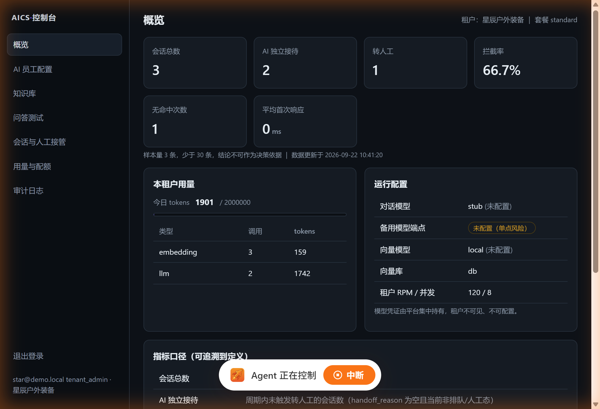
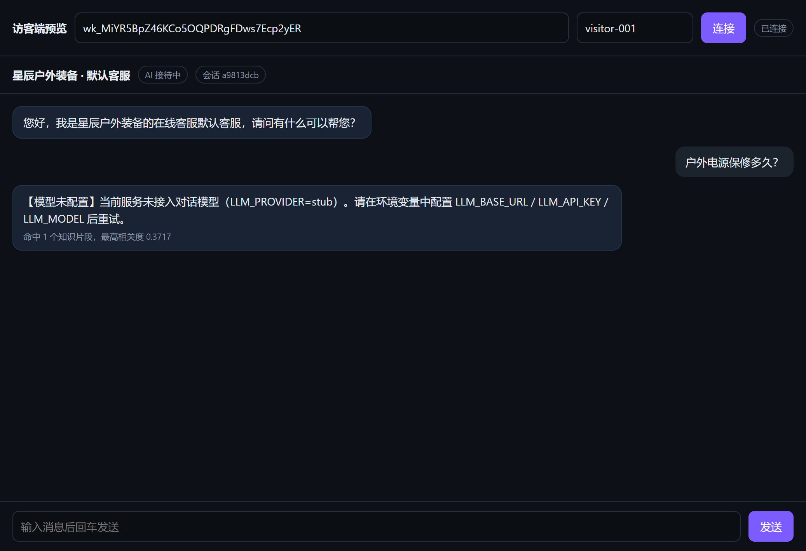

# AICS · 多租户 AI 客服系统

一套**可运行**的多租户 AI 客服系统实现，用于替代人工客服。同一套服务同时服务多个租户，
租户之间的数据、知识库、会话、额度彼此隔离。

- 后端：FastAPI + SQLAlchemy 2.0 + Pydantic v2，零外部依赖即可本地跑通
- 前端：内置管理控制台（`/admin`）+ 访客对话挂件（`/widget`），纯静态、无构建步骤
- 对话模型：已接入 **`deepseek-v4-flash`**（PackyAPI 中转，OpenAI 兼容 `/chat/completions`）
- 向量模型：已接入 **Gitee AI 模力方舟 `bge-m3`**（1024 维，OpenAI 兼容 `/embeddings`）
- 向量库：已接入 **Qdrant Cloud**（`VECTOR_BACKEND=qdrant`），带重试与熔断
- 状态：**140 项自动化测试全绿**；真机验证六套脚本全绿
  （对话模型 20 项、端到端对话 15 项、向量模型 12 项、Qdrant 云端隔离 15 项、上传链路 20 项、
  聊天式 AI 员工测试 16 项）

---

## 1. 快速开始

```bash
cd aics
python -m pip install -r requirements.txt

# 本地开发（SQLite + 占位向量 + 占位模型，无需任何外部服务）
python run.py
```

启动后打开：

| 地址 | 说明 |
| --- | --- |
| http://127.0.0.1:8000/admin | 管理控制台 |
| http://127.0.0.1:8000/widget?key=<渠道凭证> | 访客对话挂件 |
| http://127.0.0.1:8000/docs | 接口文档（Swagger） |
| http://127.0.0.1:8000/healthz | 健康检查 |

首次启动会自动初始化平台管理员与两个演示租户（**演示数据仅在 `ENV != prod` 且
`BOOTSTRAP_DEMO=true` 时创建**）。

### 演示账号

| 账号 | 密码 | 角色 | 说明 |
| --- | --- | --- | --- |
| admin@aics.local | admin12345 | 平台管理员 | 开租户、看全平台用量 |
| star@demo.local | demo12345 | 租户管理员 | 星辰户外装备 |
| sea@demo.local | demo12345 | 租户管理员 | 海蓝家居 |

两个演示租户的知识库里各埋了一条**只属于自己的机密**（星辰 `STAR20`、海蓝 `SEA30`）。
用 A 租户的挂件去问 B 租户的机密，必然查不到 —— 这是隔离是否生效最直观的验证方式。

---

## 2. 目录结构

```
aics/
├── run.py                     # 开发启动脚本
├── .env / .env.example        # 配置（含全部边界值）
├── app/
│   ├── main.py                # 应用装配、异常映射、静态资源挂载
│   ├── config.py              # 全部可调参数与边界值（对应 PRD 第八章）
│   ├── models.py              # 全部数据模型（租户级表一律带 tenant_id）
│   ├── schemas.py             # 请求/响应模型，边界值校验集中在此
│   ├── deps.py                # 身份、租户上下文、渠道凭证 → 租户解析
│   ├── scoping.py             # 租户作用域查询（fail-closed）
│   ├── security.py            # 口令哈希、JWT（内嵌 tid）、渠道凭证生成
│   ├── audit.py               # 审计留痕（含越权拒绝记录）
│   ├── ratelimit.py           # 租户级 RPM / 并发 / token 配额
│   ├── llm.py                 # 对话模型适配（主+备端点、思维链过滤、截断检测、配置错识别）
│   ├── embedding.py           # 向量模型适配（api=bge-m3 / 本地占位），带重试与熔断
│   ├── resilience.py          # 共用的退避重试与熔断器（向量模型 + 向量库）
│   ├── vectorstore/           # 向量库抽象：db / qdrant / pgvector（含重试与熔断）
│   ├── textparse.py           # 文档解析：PDF/DOCX/XLSX/CSV/TXT/MD
│   ├── rag.py                 # 切分、入库、检索、去重、清理
│   ├── prompting.py           # 人设渲染 + 系统提示词加固（禁止编造等硬约束）
│   ├── intent.py              # 意图/风险识别（转人工、投诉、广告、无意义…）
│   ├── agent.py               # 一轮对话的编排（PRD 第四/六章的决策顺序）
│   ├── provision.py           # 开租户、默认员工/知识库/渠道凭证
│   ├── teardown.py            # 租户数据销毁（删除顺序的唯一出处）
│   ├── bootstrap.py           # 首次启动初始化与演示数据
│   ├── routers/               # auth / platform / employees / knowledge
│   │                          # chat / sessions / playground / testchat / insights
│   └── static/                # admin.html（控制台）、widget.html（访客挂件）
├── smoke_test.py              # 真实 HTTP 冒烟
├── verify_llm.py              # 对话模型真机验证（不编造 / 配置错识别 / 截断）
├── verify_chat_e2e.py         # 端到端真实对话验证（打印客户实际看到的那句话）
├── verify_embedding.py        # 向量模型真机验证 + MIN_SCORE 定标
├── verify_rag_e2e.py          # 真模型端到端检索验证（不依赖云端向量库）
├── verify_qdrant.py           # Qdrant 真机隔离验证（可重复）
├── verify_upload.py           # 知识库上传全链路（PDF 中英文 / 扫描件 / 坏文件 / 格式白名单）
├── verify_testchat.py         # 聊天式 AI 员工测试真机验证（多轮 / 兜底 / 隔离）
└── tests/                     # 140 项测试：隔离 + 流程 + 边界值 + 模型/库适配层 + 切分 + 解析层
```

---

## 3. 多租户隔离怎么保证（四道防线）

隔离不靠"记得加 where 条件"，而是靠结构性约束：

1. **租户上下文只从服务端推导**：登录 JWT 内嵌 `tid`；访客侧由渠道凭证
   （`X-Widget-Key`）反查租户与 AI 员工。**请求体里传的 tenant_id 一律不采信**。
2. **查询走强制作用域**：业务代码统一用 `TenantScope` 取数，它自带 `tenant_id` 过滤；
   取不到（含跨租户）返回 404 而不是 403，避免泄漏"这条数据存在"。
3. **向量检索把 tenant_id 设为必填位置参数**：`VectorStore.search(tenant_id, ...)`，
   忘了传直接报错，不给"漏过滤"留机会；检索结果还会按 tenant_id 二次回查确认。
4. **越权一律留痕**：拒绝访问写审计日志，平台侧可查。

`tests/test_isolation.py` 覆盖了跨租户读员工/知识库/检索/会话、凭证换租户、
租户停用后全面封锁等场景。

---

## 4. 接真实模型与向量库

本地默认全部走占位实现（链路可跑通、但不产生真实回答）。上线时改 `.env` 即可，**不用改代码**：

```ini
# 1) 对话模型（OpenAI 兼容协议）
LLM_PROVIDER=api
LLM_BASE_URL=https://cf.api.fan/v1    # 注意带 /v1
LLM_API_KEY=sk-xxxx
LLM_MODEL=deepseek-v4-flash
# 推理模型的「思考」也占这份预算且照常计费，配小了会把回答截成半句
LLM_MAX_TOKENS=1200
# 连续失败到阈值后熔断：冷却期内直接降级转人工，不让每条消息都白等一轮退避
LLM_BREAKER_THRESHOLD=3
LLM_BREAKER_COOLDOWN=15
# 可选：备用端点，主端点异常时自动降级
LLM_FALLBACK_BASE_URL=
LLM_FALLBACK_API_KEY=
LLM_FALLBACK_MODEL=

# 2) 向量模型（检索召回）
# 当前接入 Gitee AI 模力方舟的 bge-m3：1024 维，支持一次传多条 input。
EMBED_PROVIDER=api
EMBED_BASE_URL=https://ai.gitee.com/api/v1
EMBED_API_KEY=<your-key>
EMBED_MODEL=bge-m3
EMBED_DIM=1024               # 必须等于模型真实输出维度，启动自检会真打一次接口核对
MIN_SCORE=0.45               # 相似度门槛，换模型/改 CHUNK_SIZE 后必须重新定标

# 3) 向量库：db（关系库暴力检索，开箱即用）/ qdrant / pgvector
VECTOR_BACKEND=qdrant
QDRANT_URL=https://<cluster-id>.<region>.aws.cloud.qdrant.io
QDRANT_API_KEY=<api-key>
QDRANT_COLLECTION=aics_chunks
```

> 用 `db` 后端时向量以 JSON 存在 `chunks.embedding` 列，适合中小规模，也适合**离线开发**
> （网络不通时把 `VECTOR_BACKEND` 改回 `db` 即可继续用）。
> 数据量上来后换 `qdrant` / `pgvector`，`chunks` 表仍保留原文便于回查。
> **换向量库或换向量模型后都需要重新入库**（不同模型的向量不可混用）。

### 对话模型接入要点（deepseek-v4-flash，都是接了真模型才暴露的坑）

| 事项 | 说明 |
| --- | --- |
| **网关会把「写错了」报成 5xx** | 实测 PackyAPI：**模型名写错返回 503**（不是 404），真正的 `model_not_found` 藏在响应体里。只看状态码的话，它属于「可重试」——白等两轮退避、照样失败，最后报「模型暂时不可用」，把**配置写错了**伪装成**服务在抖动**。所以适配层**必须读响应体判定**，不能只看状态码。判定命中后立即失败、不重试、不切备用端点，并把上游原文（含错误码与中文说明）原样透出 |
| **思维链绝不能进客户回复** | 推理模型的响应里同时有 `content`（正式回答）和 `reasoning_content`（思考过程，含「我不确定要不要…」这类自言自语）。适配层只取 `content`。一旦把两者拼接，等于当着客户的面自曝 |
| **思考 token 也算钱、也占预算** | 实测一次简单问答：22 个输出 token 里 **19 个是 reasoning**。`completion_tokens` **已包含** `reasoning_tokens`，所以按 `total_tokens` 计量即可，不需要额外加；但 `max_tokens` 配小了会撞上限 |
| **截断必须被识别** | 撞上限时 `finish_reason="length"`，客户收到半句话。适配层会标记 `truncated` 并记 warning（实测已验证能捕到），**但不自动纠正** —— 该调的是 `LLM_MAX_TOKENS`（或员工级的「最大输出 tokens」） |
| **模型名要在该 Key 的令牌分组下** | 中转网关按「令牌分组」限制可用模型，分组选错的表现就是"模型不存在"。核对办法：`GET {LLM_BASE_URL}/models` 看清单里有没有它 |
| **连接池按事件循环缓存** | 同向量模型：httpx 客户端绑在创建它的 loop 上。注意**不能用 `id(loop)` 当 key** —— loop 对象回收后 id 会被复用，会偶发命中已关闭循环的客户端（症状就是 `Event loop is closed`，但只在特定 GC 时机出现）。必须用 loop **对象本身**比对 |
| **无知识命中时不调用模型** | 这是刻意的防编造设计：hits 为空 → 直接走兜底/转人工，不让模型自由发挥。副作用是答案若只在上下文里（如「我刚才说我叫什么」）会被兜底掉；但只要那句话说到了知识库内容，上下文照常可用 |

### Qdrant 接入要点（都是真机才暴露的坑）

| 事项 | 说明 |
| --- | --- |
| **过滤字段必须先建索引** | Qdrant 用没索引的字段做过滤不是"变慢"，而是直接 400。所以 `tenant_id` / `kb_id` / `doc_id` **三个**都要建索引；且集合已存在时也要补建，否则老集合永远缺索引 |
| **集合维度固定** | 集合建好后维度不可改。换 embedding 模型（如 512→1536）时系统会**立刻报错并给出修法**，而不是静默返回垃圾结果 |
| **重试 + 熔断** | 云端在公网上，TLS 抖动（`UNEXPECTED_EOF_WHILE_READING`）会让单条消息降级。抖动做退避重试；真故障则熔断，冷却期内直接降级——实测降级响应从 ~1500ms 降到 **5~12ms** |
| **维度不匹配与网络故障分开处理** | 4xx/配置错**不重试也不熔断**（重试只会把 bug 伪装成"服务不稳定"） |
| **集合由应用自动创建** | 不需要在控制台手工建集合；首次写入时会自动建好并补上三个 payload 索引。控制台里看不到 `aics_chunks` 是正常的——还没写过数据 |
| **控制台能打开 ≠ 集群端点可达** | Qdrant Cloud 控制台的集合列表走的是**管理面** `cloud.qdrant.io`，不经过你集群的数据面域名（`<cluster-id>.<region>.aws.cloud.qdrant.io`）。所以控制台一片 GREEN，端点照样可能不通。判定方法：拿管理面域名做对照组，同一台机器上一起测；若管理面 200、数据面 `000`（TLS 立刻 EOF），就是**路径或集群侧**的问题，与本机代理配置无关。排查顺序：代理节点 → 集群状态（免费版会被暂停）→ API Key 有效期 |

### 向量模型接入要点（bge-m3，都是接了真模型才暴露的坑）

| 事项 | 说明 |
| --- | --- |
| **维度必须对齐** | bge-m3 输出 **1024** 维；`EMBED_DIM` 配错时，启动自检会**真打一次接口**并把「模型实际返回 N 维 / 配置 M 维」写进日志，而不是等第一条客户消息才 503 |
| **`MIN_SCORE` 必须重新定标** | 相似度门槛**不能按「单句 vs 单句」的相似度来定**（那个数能到 0.7，会把门槛定到 0.55 这种拦掉真答案的水平）。真实检索是「短查询 vs 混着多主题的块」，实测 bge-m3：答案块 0.47~0.71，离题查询 0.36~0.44 → 取 **0.45**。改模型或改 `CHUNK_SIZE` 都要重跑 `verify_embedding.py` |
| **切分不能一路并到上限** | 把 6 条 FAQ 并在一个 302 字的块里，直问其中一条的折扣码只有 **0.51**（不召回）；独立成块是 **0.78**。所以并段有上限 `min_fill = CHUNK_SIZE//3`，只为了解决碎块 |
| **连接池必须按事件循环分别缓存** | httpx 客户端绑在创建它的那个 loop 上。跨 loop 复用会抛 `Event loop is closed`，而且发生在**非请求路径**上（演示知识库静默入库失败，只剩一句 warning） |
| **4xx 不重试也不熔断** | 模型名写错 / Key 失效会回 400/401。这类常量配置 bug 重试 3 次再熔断 15 秒，只会把排查方向带偏成「服务不稳定」；上游错误原文会原样透出 |
| **5xx / 网络错要重试** | 公网抖动不该让一次入库或一条客户消息直接失败 |
| **按 `index` 归位** | 上游不保证 `data` 顺序，错位会让向量与文本错配且完全静默 |

### 向量库不可用时的行为

系统**不会因此起不来，也不会 500**：

- 启动自检失败 → 日志明确报错并给出排查项，`/healthz` 返回 `degraded: true` + 原因；
- 对话请求 → 走降级话术并转人工，**绝不编造答案**；
- `degrade_reason` 会**保留上游真实原因**（如"向量库不可用"）而不是被后面的
  "无知识命中"覆盖——否则运维会跑去查知识库，而真正的问题是向量库。
- 高风险场景（投诉、索赔）**不依赖检索**，因此向量库挂了也照常强转人工。

### 隔离在云端向量库上是真的生效吗

`verify_qdrant.py` 专门回答这个问题，用**同一个向量只换租户过滤**来证伪"查不到是因为数据为空"：

```bash
python verify_qdrant.py              # 跑完自动清理测试租户
python verify_qdrant.py --reset      # 先删集合重建，保证可重复
python verify_qdrant.py --keep       # 保留数据，便于在 Qdrant 控制台按 payload 核对
python verify_qdrant.py --reset --force   # 集合非空 / ENV 非 dev 时，必须显式确认才允许删
```

> `--reset` 是**不可逆**操作，所以默认 fail-closed：非 `dev`/`test` 环境、读不到集合信息、
> 集合内仍有数据，这三种情况都会**拒绝执行**并要你加 `--force`。
> 删除前会打印「要删哪个集合、当前多少点」。

输出里会打印不加过滤时 Qdrant 的最近邻，例如
`[('…B…', 1.0), ('…A…', 0.9509)]` —— **A 自己的分片以 0.95 相似度排第二**，
说明过滤一旦失效 A 的查询会把 B 的分片排在最前面。隔离是承重的，不是数据碰巧为空。

模型不可用时的行为是刻意设计的：**明确告知"模型未配置/不可用"并转人工，绝不编造答案**。

---

## 5. 验证方式

```bash
# 自动化测试（隔离 + 发布版本 + 对话链路 + 边界值 + 向量模型/库适配层 + 切分，离线可跑）
python -m pytest

# 真实 HTTP 冒烟（需先启动服务；脚本默认打 8123 端口，用 AICS_BASE 覆盖）
set AICS_BASE=http://127.0.0.1:8000
python smoke_test.py

# 对话模型真机验证（需 LLM_PROVIDER=api）：不编造 / 不泄漏思维链 / 配置错识别 / 截断检测
python verify_llm.py

# 端到端真实对话验证（需先启动服务）：把客户实际看到的那句话打出来
python verify_chat_e2e.py

# 向量模型真机验证 + 给 MIN_SCORE 定标（需 EMBED_PROVIDER=api）
python verify_embedding.py

# 真模型端到端检索验证（用 SQLite 向量后端，云端向量库不通时也能跑）
python verify_rag_e2e.py

# Qdrant 真机隔离验证（需 VECTOR_BACKEND=qdrant 且网络可达）
python verify_qdrant.py --reset

# 知识库上传全链路验证（需先启动服务）：PDF 中英文 / 扫描件 / 损坏文件 / 白名单外格式
python verify_upload.py

# 聊天式 AI 员工测试真机验证（需先启动服务）：多轮链路 / 兜底不编造 / 隔离 / 清理
python verify_testchat.py

# 客服准确率评测：用《Amazon 供应链标准手册》86 题跑一遍（需先启动服务）
python eval/amazon_supply_chain/run_accuracy_eval.py
python eval/amazon_supply_chain/diagnose_recall.py A10   # 单题排查：为什么这题答不上来
```

`smoke_test.py` 会依次验证：健康检查、平台与两个租户登录、**跨租户读数据被拒**、
**A 租户检索不到 B 租户机密（双向验证）**、对话命中本租户知识、
按模型是否已接入分别断言「基于片段作答」或「如实说明模型未配置」、投诉类强制转人工、审计接口可用。

`verify_llm.py` 会把真实的 system prompt 喂进去验证模型行为：连通与鉴权、模型名回显、
**配置错误是否被识别成配置错而非服务抖动**（用不存在的模型名实测，并检查没白等重试）、
有片段时必须依据片段作答、**库外问题必须说「没有」且不出现任何具体数字**、
高风险话题不自行承诺、**思维链不外泄**、**撞到长度上限被标记 truncated**、多轮上下文。

`verify_chat_e2e.py` 走完整链路打真实 HTTP，把回答原文打印出来 —— 前几个脚本都通过时，
仍可能出现一种情况没被排除：检索隔离没问题、模型也没编造，但提示词里混进了别家的片段，
模型就会说出来。**只有看最终那句话才排除得了。**

`verify_embedding.py` 会依次验证：连通性与鉴权、返回维度 == `EMBED_DIM`、
批量与单条一致（顺序未错位）、空文本兜底、**短查询 vs 真实切分块的语义有效性**
（Top-1 必须命中答案块、离题查询必须过不了门槛），并输出**建议的 `MIN_SCORE`**：
答案块得分下限与噪音得分上限之间取 40% 位置（偏保守——漏召只是转人工，
误召会让模型拿着不相干的段落编出很像真的答案）。

`verify_rag_e2e.py` 用真实 bge-m3 走完「入库 → 检索 → 租户隔离」全链路，
除向量库后端用 `db` 外与生产完全一致；云端向量库不可达时也能证明检索是有效的。

`verify_qdrant.py` 会依次验证：连通性与集合维度、跨租户检索隔离、**同一向量换过滤**、写入侧隔离、**维度守卫会报错并给出修法**、清理。退出码非 0 表示有失败项。

`verify_upload.py` 会依次验证：中文 PDF（现场构造带 ToUnicode 的 Type0 PDF，即 Word/WPS 导出的那套编码）与英文 PDF 的**上传 → 入库 → 检索召回**，扫描件（无文字层）必须给出可操作提示、损坏 PDF 只能让单个文件失败而不能拖垮整个请求、白名单外格式要列出支持列表、**混合上传时好文件不能被坏文件连累**。跑完自动删除临时知识库。

`verify_testchat.py` 走四轮真实对话：文档内问题（应命中并答对）、带历史的同主题追问（多轮链路不断且仍能检索）、上下文指代类提问（**预期被兜底**，见第 8 节，脚本会把它标成已知设计而不是失败）、文档外问题（必须承认查不到）。再校验：四轮历史完整且 AI 的兜底回复也在（这是「刷新后回复消失」的回归）、测试会话不进概览统计与坐席列表、删除后消息一并清掉。跑完自动清理，退出码非 0 表示有失败项。

---

## 6. 知识库上传支持哪些格式

| 格式 | 支持 | 说明 |
|---|---|---|
| `.pdf` | ✅ | 走 `pypdf` 提取文字层。**扫描件 / 图片版 PDF 提取不到文字**，会明确报错并建议改用文本版或 DOCX/TXT |
| `.docx` | ✅ | 段落 + 表格都会读（表格里的保修期往往才是答案） |
| `.txt` / `.md` | ✅ | 自动识别编码（UTF-8 / GB18030 / Big5），中文不乱码 |
| `.csv` / `.xlsx` | ✅ | 转成「字段: 值」的自然语言行，否则问句与表格对不上 |
| `.xls` | ⚠️ | 在扩展名白名单里，但**解析器明确拒绝**旧版格式，会提示另存为 `.xlsx` 或 `.csv`。这是有意的：直接拒绝并给出转换建议，比让用户以为传成功了更好 |

边界值：单文件 20MB、单次 10 个、单库 500 个文档 / 1GB。**单个文件失败不影响同批其他文件**。

**重复上传会被拦掉**：同库内「同名 + 同大小」视为同一份文件，直接返回失败并提示改用删除或「重建索引」。
为什么必须拦——重复副本会产生**同分**的重复片段把 `top_k` 召回位占满。实测同一份 37 片段的 PDF 传 4 次后：

| | 清理前 | 清理后 |
|---|---|---|
| 「亚马逊供应链标准是什么」top-5 | `0.7926 ×4` + 0.7672（4 份副本） | 0.7926 / 0.7672 / 0.7595 / 0.7219 / 0.7168（**5 段不同内容**） |
| 「审计要求有哪些」top-5 | `0.6627 ×4` + 0.6479 | 0.6627 / 0.6479 / 0.6242 / 0.6224 / 0.6205 |

删除文档/知识库**会连带删除向量**（实测文档删除后集合点数 152 → 41）。
注意 `/healthz` 里的 `vector.points` 是**启动时的快照**，不是实时值——要核对实时数量请直接查集合。

---

## 7. 界面

侧栏共 7 项：概览 / 知识库 / **AI 员工测试** / 问答测试 / 用量与配额 / 审计日志 / 平台运营。

管理控制台（`/admin`）——租户概览、用量与配额、运行配置：



**AI 员工测试**（`/admin` → AI 员工测试）——聊天式真实对话。发消息、AI 回复，
每条 AI 回复下面带「命中几段 / 最高相关度 / 置信度 / 耗时 / tokens」，可展开看检索片段：

- 与「问答测试」的分工：问答测试是**单轮批量**回归（不落库、无上下文，86 题评测脚本走它）；
  这里是**多轮真聊天** —— 消息落库、上下文连续、走与线上完全相同的 `agent.handle_turn`。
- 测试会话**不计入线上统计**，也不出现在坐席会话列表里；「新对话」另起一轮空白，
  「清空测试记录」只删测试数据。

访客挂件（`/widget`）——与真实接口打通，检索命中会显示来源片段数与相关度：



### 本轮范围调整（2026-09-23）

| 调整 | 范围 |
| --- | --- |
| 移除「AI 员工配置」页面 | **只移除前端页面**，后端 `employees` 路由原样保留。系统自动选用默认 AI 员工；知识库绑定改到「知识库」页的「AI 客服启用」开关（改动即时生效） |
| 移除「会话与人工接管」页面 | **只移除前端页面与坐席操作**。后端转人工逻辑（`sessions` 路由、`agent` 的 handoff 判定）全部保留，概览里的「转人工」指标照常统计 |
| 新增「AI 员工测试」 | 新页面 + 新路由 `app/routers/testchat.py` |

**一个需要知悉的产品矛盾**：转人工逻辑保留了，但接管界面移除了 —— 所以
AI 说「已为您转接人工客服」时，实际上没有人能接管。若短期不恢复坐席界面，
建议把员工的低置信度策略设为 `fallback`（兜底话术回复），避免给出无法兑现的承诺。

---

## 8. 本期边界（有意不做的部分）

- **人工客服工作台**：本期只做 AI 员工替代人工。转人工的**判定与状态流转保留在后端**，
  但坐席界面已移除（见第 7 节），所以当前没有人工接管的入口；不含坐席排班、技能组、工单流转。
- **AI 员工配置界面**：后端配置能力完整保留（人设、阈值、模型参数、渠道开关、版本发布、
  回滚），但不再提供配置页面 —— 界面上唯一保留的配置是「知识库绑定」（知识库页的
  「AI 客服启用」）。需要改人设或阈值时直接调 `PATCH /api/employees/{id}`。
  这是有意收窄，不是能力缺失；要恢复界面，把 `admin.html` 里的员工页加回来即可。
- **第三方社媒渠道接入**：微信/WhatsApp/Facebook 等渠道的凭证申请与消息通道**不在本期范围**，
  渠道开关、渠道凭证表已预留，后续接渠道只做适配层。
- **对外接口（Webhook / OpenAPI）**：不纳入，若需要单独立项。
- **平台治理**（认证对接、白标、租户计费出账）：本期不做，`platform` 路由只提供开租户、
  配额调整、租户停用/注销。
- **无知识命中时不调用模型**：这是刻意的防编造设计（宁可不答，不许乱答）。
  已知副作用：若某句话的答案只在对话上下文里、而内容不沾知识库（例如"我刚才说我叫什么"），
  会被兜底掉。判断是否需要放宽（例如"有上下文时允许模型仅依据历史作答"）属于产品决策，
  本期保持紧缩口径。
  **这条在「AI 员工测试」里会被直接看到**：`verify_testchat.py` 第 4 轮问「我上一个问题问的是什么」，
  实测被兜底。要注意的是**历史确实进了提示词**（第 2 轮的 tokens 比第 1 轮多，就是前几轮对话的增量），
  只是这一问本身不沾知识库，系统按设计没有调模型。别把设计取舍当成上下文丢失。

上线前必改项见同目录 `../AI客服系统_上线准备清单.md`（JWT 密钥、数据库、多进程限流、
备份与监控等）。
